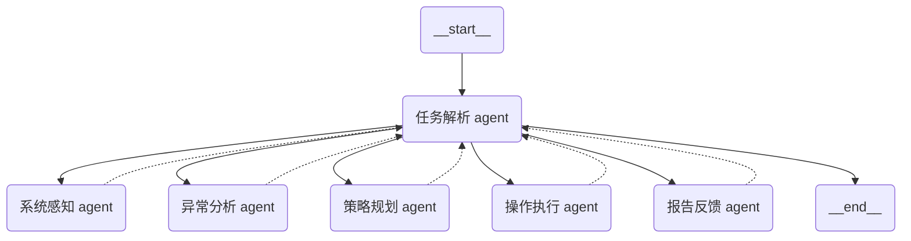
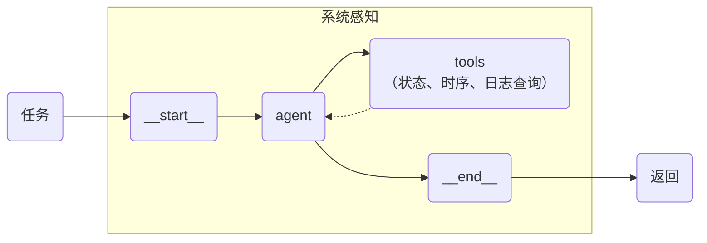
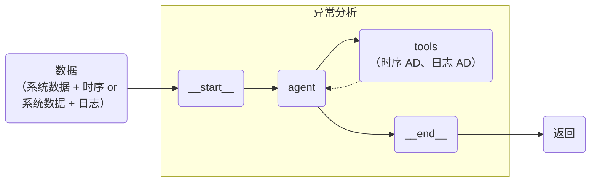
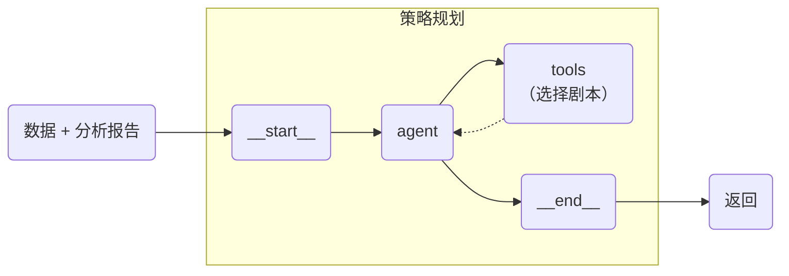
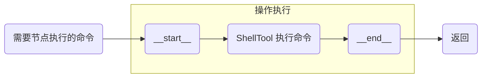
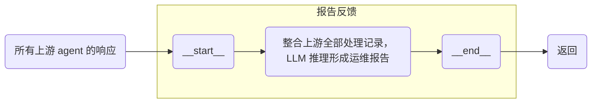

# NSCC-MultiAgents

 

[](https://www.python.org/) [](https://www.langchain.com/langgraph)


## 📖 索引
1. [项目简介](#-项目简介)
2. [多智能体](#-多智能体)
3. [大模型](#-大模型)

## 📝 项目简介
这是使用 [LangGraph](https://github.langchain.ac.cn/langgraph/) 搭建的多智能体运维助手项目。

### 📘 项目分支结构
```
├── agent_a6000/
│   ├── task_analysis/    # 任务解析
│   └── anomaly_analysis/    # 异常分析
│   └── strategy_plan/    # 策略规划
│   └── report_generate/    # 报告反馈
├── agent_mn10/
│   ├── system_perception/    # 系统感知
│   └── command_run/    # 操作执行
├── anomaly_model/    # 异常检测和根因定位的模型
│   ├── AnomalyDetection/    # 系统感知
│   └── HPC_RCA_Demo/    # 操作执行
├── llm_model/    # vllm 本地部署 Qwen3-30B-A3B 大模型的文件
├── rag_grpc/    # 使用 gRPC 启动 RAG 服务的文件
├── task_acc_test/    # 大模型任务意图识别模块的测试文件
└── ...
```

## 🤖 多智能体
### 🧩 角色划分
① 任务解析 agent（系统决策智能体）
> 部署位置：`a6000`

② 系统感知 agent（专家智能体），包含：数据分析工程师；时间序列数据库专家；日志数据库专家；系统状态专家
> 部署位置：`mn10`

③ 异常分析 agent（专家智能体），包含：日志异常检测模型；时序异常检测模型
> 部署位置：`a6000`

④ 策略规划 agent（专家智能体）+ RAG（先匹配规则，没有规则的再由 LLM 规划）
> 部署位置：`mn10`

⑤ 操作执行 agent（专家智能体：运维工程师）：LLM 模拟操作结果
> 部署位置：`各操作节点`

⑥ 报告反馈 agent（专家智能体）
> 部署位置：`a6000`

### 🤝 协作流程


### 细分子流程
#### 任务解析
- 核心功能：**中控代理**，通过**意图识别模块**生成 DAG 工作流，引导下属子代理执行
- 根据用户查询进行意图识别（LLM 推理），生成 DAG，包含所有 agents 的任务子图
- 注册所有的子 agents 为 LangGraph 节点，编译图，执行工作流
- 综合管理所有 agent 处理过程的记忆
- 使用 OpenAI 接口暴露，供前端组件调用

#### 系统感知


#### 异常分析
根据查询到的系统//时序/日志数据进行异常分析，得到正常/异常结果。
是否需要报告？



#### 策略规划
面对异常/正常情况，给出运维人员解决方案，由运维人员决定是否执行（Human-in-the-loop）



#### 操作执行


#### 报告反馈


Loading...

