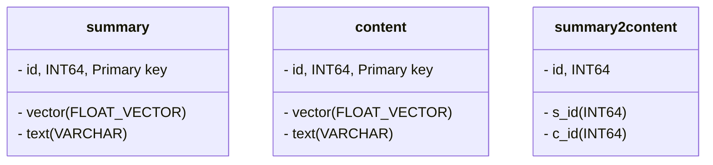

  

# NSCC-milvus

## 📖 索引
1. [项目简介](#-项目简介)
2. [如何使用](#-如何使用)

## 📝 项目简介
这是使用 Python 搭建的 Milvus 向量知识库项目代码。

### 📘 项目分支结构
```
├── app/    # 知识库检索的测试目录。启动 milvus 检索服务，发送 query，返回相关文档内容
│   └── ...
├── dataset/
│   ├── pdf/
│   └── markdown/
│   └── docx/
│   └── ...
├── preprocess_data_files/    # 处理好的文档全文内容 + 分块/摘要
│   ├── pdf/
│   │   ├── content/
│   │   └── summary/
│   └── markdown/
│   │   └── ...
│   └── docx/
│   │   └── ...
│   └── ...
├── processor/    # 负责处理不同文档的类
│   ├── PdfProcessor.py
│   └── MdProcessor.py
│   └── DocxProcessor.py
│   └── ...
└── milvus_app_test.py    # 向知识库发送测试 query
└── doc_process.py    # 获取数据集目录下的文档，调用相应类处理
└── MilvusAPI.py    # 存放 milvus 的公用处理方法以及 RAG
└── milvus_demo.py    # 主文件，创建知识库、文档处理、文档嵌入、插入知识库
└── ...
```

### 📊 知识库结构


## ❓ 如何使用
✅ 确保服务器上的 milvus 服务已启动
```bash
systemctl status milvus
```
否则：
```bash
systemctl start milvus
```

### 🔧 文档处理、插入知识库
#### Step 1：整理文档
需要输入知识库的文档，按照其类型放入 `dataset` 的相应目录下
```
├── dataset/
    ├── pdf/
    └── markdown/
    └── docx/
    └── ...
```

#### Step 2：执行
安装并激活 conda 环境（建议自行安装虚拟环境和相关依赖）
```bash
conda env create -f env.yml
conda activate milvus
```

运行脚本
```python
python milvus_demo.py --dataset <dataset> --emb_model <model-name> --sum_model <model-name>
```

#### 💡 注意事项
目前支持的文档类型（`--dataset`）：
- pdf
- markdown
- docx

目前支持的嵌入模型（`--emb_model`）：
- sentence-transformers/LaBSE
- Alibaba-NLP/gte-multilingual-base（2024 年新方法，评分较高）

目前支持的摘要生成模型（`--sum_model`）：
- t5（本地模型，效果一般）
- qwq（通义千问，模型可另选）
- agent（本地部署的 LLM，调试状态，不稳定）

### 🧪 知识库检索测试
#### ✅ 测试方法一：使用 app 服务测试
进入目录
```bash
cd app
```

运行 app 服务（可选：0.0.0.0/8000）
```bash
uvicorn main:app --host <hostname> --port <port>
```

另开终端执行
```bash
python milvus_app_test.py
```

#### ✅ 测试方法二（推荐）：单脚本测试
进入目录
```bash
cd app
```

运行脚本
```bash
python milvus_handler.py
```

